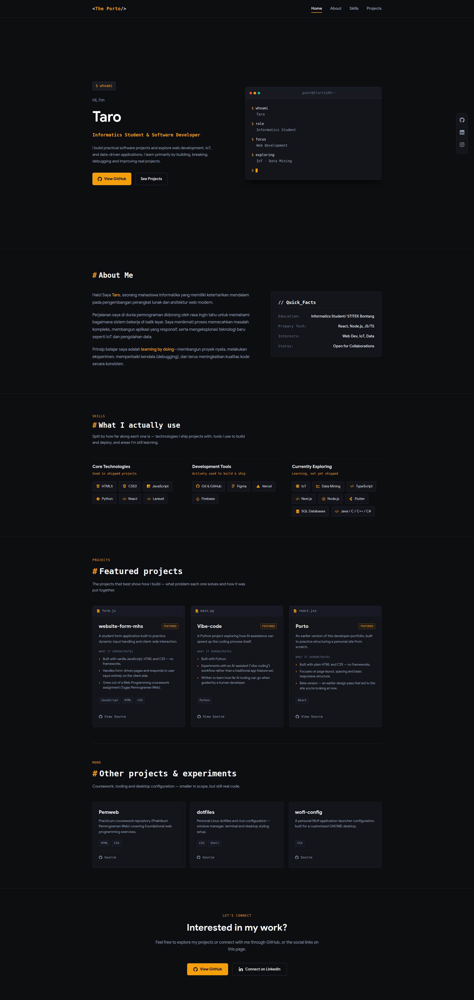

# Porto

  
<strong>Modern, Modular Terminal-Inspired Portfolio</strong>

  <!-- Banner Preview -->
  

   
   

  

    
    
    
  

  <a href="https://myporto-mocha-ten.vercel.app/"><strong>View Live Demo »</strong></a>

